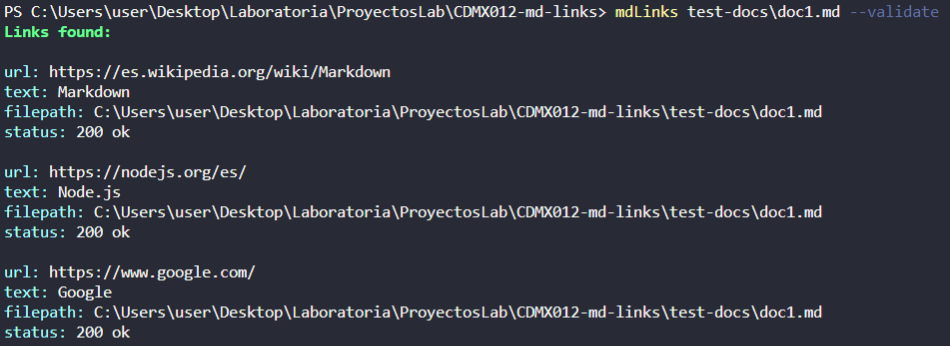

# mdLinks

## Contents

* [1. Highlights](#1-highlights)
* [2. About the project](#2-about-the-project)
* [3. Installation](#3-installation)
* [4. Usage](#4-usage)
* [5. Examples](#5-api)

***

## 1. Highlights

* Promise based library. 
* Recursively reads all the folders found inside the given path if it is a directory. 
* Link extraction supported by the use of RegExp.
* Quickly identifies any broken or deprecated links.
* Delivers basic and complete stats about the links found. 

## 2. About the project

The mdLinks library provides the user with an efficient solution to extract the links inside the markdown files found in a given path and make HTTP requests for each of them. This tool can work with files or directories, being able to recursively read any folders found inside of the provided directory until it finds all the markdown files it contains. 

This project has the following dependencies:
* [Yargs](https://www.npmjs.com/package/yargs)
* [Chalk](https://github.com/chalk/chalk)
* [Axios](https://github.com/axios/axios)

Tested using [Jest](https://jestjs.io/). 

To set up the logic behind this application I elaborated a [flowchart](#flowchart) stating the paths the program would follow given certain circumstances and inputs, you can check it out at the end of this file. 

## 3. Installation

Run the next command in your terminal: 
`npm install PerlaDelAngel/CDMX012-md-links`

## 4. Usage

To use this library you'll need to run it in the terminal with the command `mdLinks` along with the path (absolute or relative) you want to analyze and any of the options provided below, resulting in something like this: 

`mdLinks 'absolute or relative path' --validate --stats`

If no option is provided, the library will process the given path, obtain the links inside the markdown files and return the following information about each link: href, associated text, and file path.

Additionally, you can provide a couple of different options to obtain three different kinds of information about the links found: 
* `--help` or `-h` : Shows a list of all available options and usage examples. 
* `--validate` or `-v` : Makes an HTTP request for each link and returns the obtained status for each link.
* `--stats` or `-s` : Shows the total number of links found as long as the ammount of unique urls. 
* `--validate --stats` : Show the total number of links found, unique and broken links. 

## 5. Examples

*Working with a relative path*

Input: `mdLinks test-docs\doc1.md`

Expected output:

*Working with a relative path and validate*

Input: `mdLinks test-docs\doc1.md --validate` or `mdLinks test-docs\doc1.md -v`

Expected output:

*Working with a relative path and stats*

Input: `mdLinks test-docs\doc1.md --stats` or `mdLinks test-docs\doc1.md -s`

Expected output:

*Working with a relative path, validate and stats*

Input: `mdLinks test-docs\doc1.md --validate --stats` or `mdLinks test-docs\doc1.md -v -s`

Expected output:

*Working with an absolute path*

Input: `mdLinks C:\Users\user\Desktop\Laboratoria\ProyectosLab\CDMX012-md-links\test-docs\doc2.md ` 

Expected output:

*** 

Library created by Perla Del Ángel @ Laboratoria 2022

*** 
### Flowchart
